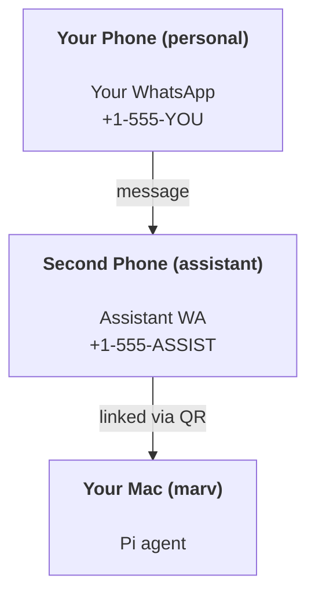

# Building a personal assistant with Marv

Marv is a WhatsApp + Telegram + Discord + iMessage gateway for **Pi** agents. Plugins add Mattermost. This guide is the "personal assistant" setup: one dedicated WhatsApp number that behaves like your always-on agent.

## ⚠️ Safety first

You’re putting an agent in a position to:

- run commands on your machine (depending on your Pi tool setup)
- read/write files in your workspace
- send messages back out via WhatsApp/Telegram/Discord/Mattermost (plugin)

Start conservative:

- Always set `channels.whatsapp.allowFrom` (never run open-to-the-world on your personal Mac).
- Use a dedicated WhatsApp number for the assistant.
- Heartbeats now default to every 30 minutes. Disable until you trust the setup by setting `agents.defaults.heartbeat.every: "0m"`.

## Prerequisites

- Marv installed and onboarded — see [Getting Started](/start/getting-started) if you haven't done this yet
- A second phone number (SIM/eSIM/prepaid) for the assistant

## The two-phone setup (recommended)

You want this:



If you link your personal WhatsApp to Marv, every message to you becomes “agent input”. That’s rarely what you want.

## 5-minute quick start

1. Pair WhatsApp Web (shows QR; scan with the assistant phone):

```bash
marv channels login
```

2. Start the Gateway (leave it running):

```bash
marv gateway --port 4242
```

3. Put a minimal config in `~/.marv/marv.json`:

```json5
{
  channels: { whatsapp: { allowFrom: ["+15555550123"] } },
}
```

Now message the assistant number from your allowlisted phone.

When onboarding finishes, we auto-open the dashboard and print a clean (non-tokenized) link. If it prompts for auth, paste the token from `gateway.auth.token` into Control UI settings. To reopen later: `marv dashboard`.

## Give the agent a workspace (AGENTS)

Marv reads operating instructions and “memory” from its workspace directory.

By default, Marv uses `~/.marv/workspace` as the agent workspace, and will create it (plus starter `AGENTS.md`, `SOUL.md`, `TOOLS.md`, `IDENTITY.md`, `USER.md`, `HEARTBEAT.md`) automatically on setup/first agent run. `BOOTSTRAP.md` is only created when the workspace is brand new (it should not come back after you delete it). `MEMORY.md` is optional (not auto-created); when present, it is loaded for normal sessions. Subagent sessions only inject `AGENTS.md` and `TOOLS.md`.

Tip: treat this folder like Marv’s “memory” and make it a git repo (ideally private) so your `AGENTS.md` + memory files are backed up. If git is installed, brand-new workspaces are auto-initialized.

```bash
marv setup
```

Full workspace layout + backup guide: [Agent workspace](/concepts/agent-workspace)
Memory workflow: [Memory](/concepts/memory)

Optional: choose a different workspace with `agents.defaults.workspace` (supports `~`).

```json5
{
  agent: {
    workspace: "~/.marv/workspace",
  },
}
```

If you already ship your own workspace files from a repo, you can disable bootstrap file creation entirely:

```json5
{
  agent: {
    skipBootstrap: true,
  },
}
```

## The config that turns it into “an assistant”

Marv defaults to a good assistant setup, but you’ll usually want to tune:

- persona/instructions in `SOUL.md`
- thinking defaults (if desired)
- heartbeats (once you trust it)

Example:

```json5
{
  logging: { level: "info" },
  agent: {
    model: "anthropic/claude-opus-4-6",
    workspace: "~/.marv/workspace",
    thinkingDefault: "high",
    timeoutSeconds: 1800,
    // Start with 0; enable later.
    heartbeat: { every: "0m" },
  },
  channels: {
    whatsapp: {
      allowFrom: ["+15555550123"],
      groups: {
        "*": { requireMention: true },
      },
    },
  },
  routing: {
    groupChat: {
      mentionPatterns: ["@marv", "marv"],
    },
  },
  session: {
    scope: "per-sender",
    resetTriggers: ["/new", "/reset"],
    reset: {
      mode: "daily",
      atHour: 4,
      idleMinutes: 10080,
    },
  },
}
```

## Sessions and memory

- Session files: `~/.marv/agents/<agentId>/sessions/{{SessionId}}.jsonl`
- Session metadata (token usage, last route, etc): `~/.marv/agents/<agentId>/sessions/sessions.json` (legacy: `~/.marv/sessions/sessions.json`)
- `/new` or `/reset` starts a fresh session for that chat (configurable via `resetTriggers`). If sent alone, the agent replies with a short hello to confirm the reset.
- `/compact [instructions]` compacts the session context and reports the remaining context budget.

## Local-first memory and proactive setup

Today’s local-first assistant stack has three separate pieces:

- `memory.autoRecall`: pulls relevant Soul Memory into the first turn. This is on by default.
- `memory.knowledge`: indexes local document vaults into memory. This is opt-in.
- `autonomy.proactive`: creates managed proactive check and digest cron jobs. This is opt-in.

Start with a config like this:

```json5
{
  memory: {
    autoRecall: {
      enabled: true,
      maxResults: 8,
      maxContextChars: 8000,
    },
    knowledge: {
      enabled: true,
      autoSyncOnSearch: true,
      autoSyncOnBoot: true,
      syncIntervalMs: 900000,
      vaults: [
        {
          name: "plans",
          path: "~/Documents/Marv/Plan",
          exclude: ["**/.git/**"],
        },
        {
          name: "notes",
          path: "~/Documents/Notes",
          exclude: ["**/.obsidian/**", "**/.git/**"],
        },
      ],
    },
  },
  autonomy: {
    proactive: {
      enabled: true,
      checkEveryMinutes: 30,
      digestTimes: ["08:00", "20:00"],
      delivery: {
        channel: "last",
      },
    },
  },
}
```

Notes:

- `memory.knowledge.autoSyncOnBoot: true` makes the Gateway scan your vaults on startup.
- `memory.knowledge.autoSyncOnSearch: true` refreshes before memory search runs.
- `autonomy.proactive.delivery.channel: "last"` sends digests back to the most recent delivery route. Set explicit `channel` + `to` if you want a fixed target instead.

After you save config changes, restart the background Gateway so the first knowledge scan and managed proactive cron jobs are created:

```bash
marv gateway restart
```

## Verify in the dashboard

Open the browser UI:

```bash
marv dashboard
```

On the **Overview** page you should now see:

- **Memory**: total items, archive events, auto recall, runtime ingest, backend, and citation mode
- **Knowledge**: vault count, indexed files, total chunks, last scan time, and search/boot sync flags
- **Proactive**: whether proactive mode is enabled, pending and urgent digest entries, next digest times, and delivery route

If the Knowledge card still shows `0` files and `0` chunks, either wait for the boot scan after restart or trigger a memory search from a normal chat turn.

## Heartbeats (proactive mode)

By default, Marv runs a heartbeat every 30 minutes with the prompt:
`Read HEARTBEAT.md if it exists (workspace context). Follow it strictly. Do not infer or repeat old tasks from prior chats. If nothing needs attention, reply HEARTBEAT_OK.`
Set `agents.defaults.heartbeat.every: "0m"` to disable.

- If `HEARTBEAT.md` exists but is effectively empty (only blank lines and markdown headers like `# Heading`), Marv skips the heartbeat run to save API calls.
- If the file is missing, the heartbeat still runs and the model decides what to do.
- If the agent replies with `HEARTBEAT_OK` (optionally with short padding; see `agents.defaults.heartbeat.ackMaxChars`), Marv suppresses outbound delivery for that heartbeat.
- Heartbeats run full agent turns — shorter intervals burn more tokens.

```json5
{
  agent: {
    heartbeat: { every: "30m" },
  },
}
```

## Local multimodal input

The local input-side multimodal path is meant for understanding what you send to the agent, not for generating media.

- **Audio**: leave `tools.media.audio.enabled` unset or set it to `true` and Marv will auto-detect local transcription tools before falling back to provider APIs. See [Audio and Voice Notes](/nodes/audio).
- **Images on macOS**: if the Gateway host is a Mac and no explicit image model is taking over, Marv can run bundled local OCR through Apple Vision. This is especially useful for screenshots, receipts, and handwritten notes. See [Media Understanding](/nodes/media-understanding).
- **Native vision models**: if your primary model already supports vision, Marv skips the extra OCR step and passes the original image through directly.

Optional OCR language hints:

```bash
export MARV_OCR_LANGUAGES="zh-Hans,en-US"
```

If you want a dedicated display + input endpoint, deploy the iOS companion app from source on an idle iPhone. It gives you dashboard status, chat, voice input, and optional foreground-only camera snapshots. See [iOS App](/platforms/ios) and [Camera Capture](/nodes/camera).

## Media in and out

Inbound attachments (images/audio/docs) can be surfaced to your command via templates:

- `{{MediaPath}}` (local temp file path)
- `{{MediaUrl}}` (pseudo-URL)
- `{{Transcript}}` (if audio transcription is enabled)

Outbound attachments from the agent: include `MEDIA:<path-or-url>` on its own line (no spaces). Example:

```
Here’s the screenshot.
MEDIA:https://example.com/screenshot.png
```

Marv extracts these and sends them as media alongside the text.

## Operations checklist

```bash
marv status          # local status (creds, sessions, queued events)
marv status --all    # full diagnosis (read-only, pasteable)
marv status --deep   # adds gateway health probes (Telegram + Discord)
marv health --json   # gateway health snapshot (WS)
```

Logs live under `/tmp/marv/` (default: `marv-YYYY-MM-DD.log`).

## Next steps

- Browser operator surface: [Dashboard](/web/dashboard)
- Control UI capabilities: [Control UI](/web/control-ui)
- WebChat: [WebChat](/web/webchat)
- Gateway ops: [Gateway runbook](/gateway)
- Cron + wakeups: [Cron jobs](/automation/cron-jobs)
- Local image/audio preprocessing: [Media Understanding](/nodes/media-understanding)
- macOS menu bar companion: [Marv macOS app](/platforms/macos)
- iOS node app: [iOS app](/platforms/ios)
- Android node app: [Android app](/platforms/android)
- Windows status: [Windows (WSL2)](/platforms/windows)
- Linux status: [Linux app](/platforms/linux)
- Security: [Security](/gateway/security)
